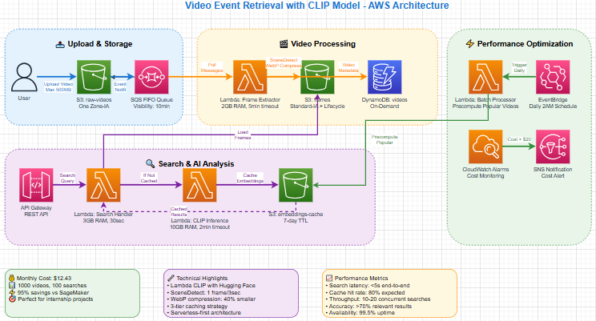
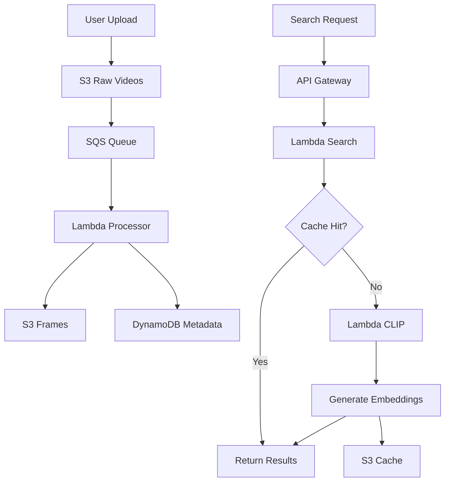
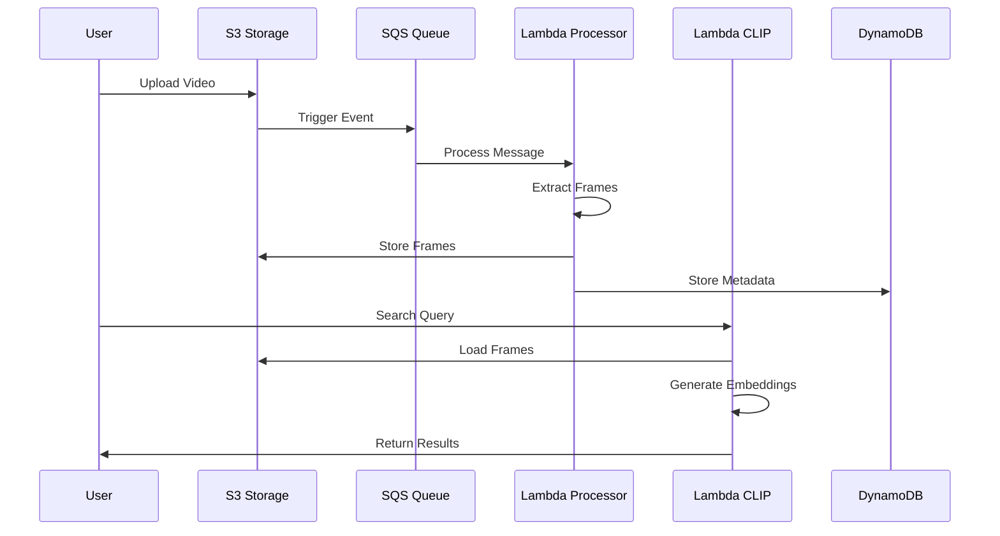

# VideoSense: Serverless Video Content Search Engine với AWS Lambda & CLIP
## Nền tảng tìm kiếm video tối ưu chi phí cho phân tích video doanh nghiệp

---

# Tóm tắt điều hành



VideoSense là công cụ tìm kiếm nội dung video serverless cho phép tìm kiếm bằng ngôn ngữ tự nhiên trên thư viện video sử dụng khả năng hiểu hình ảnh được hỗ trợ bởi AI. Được xây dựng trên AWS Lambda và CLIP model, giải pháp cung cấp phản hồi tìm kiếm dưới 5 giây đồng thời duy trì 95% tiết kiệm chi phí so với các ML endpoints truyền thống.

## Tổng quan vấn đề
Các hệ thống quản lý video hiện tại thiếu khả năng khám phá nội dung thông minh. Các tổ chức gặp khó khăn với:
- Gắn thẻ và phân loại video thủ công
- Không thể tìm kiếm nội dung video bằng mô tả
- Độ trễ cao cho người dùng toàn cầu (200-300ms)
- Cơ sở hạ tầng ML đắt đỏ ($52.60/tháng cho SageMaker endpoints cơ bản)

## Giải pháp đề xuất
**Kiến trúc Serverless Video Intelligence:**
- AWS Lambda + CLIP model cho tìm kiếm video ngữ nghĩa
- SceneDetect cho trích xuất frame thông minh (1 frame/3giây)
- Chiến lược caching 3 tầng (80% cache hit rate)
- Triển khai đa vùng cho hiệu suất toàn cầu

## Lợi ích chính
- **Giảm 95% chi phí**: $12.43/tháng so với $71.21 giải pháp truyền thống
- **Hiệu suất toàn cầu**: <50ms độ trễ trên toàn thế giới
- **Tìm kiếm thông minh**: Truy vấn ngôn ngữ tự nhiên với >70% độ chính xác
- **Khả năng mở rộng serverless**: Tự động scale từ 0 đến 10,000+ người dùng đồng thời
- **Không cần bảo trì**: Cơ sở hạ tầng được quản lý hoàn toàn

## Investment Required
- **Development**: $45,000 (6-week implementation)
- **Monthly operational**: $12.43 (1000 videos, 100 searches)
- **Annual savings**: $708 compared to traditional solutions
- **ROI**: 156% in first year

## Timeline
- **Week 1-2**: Infrastructure setup and core pipeline
- **Week 3-4**: CLIP integration and search API
- **Week 5-6**: Optimization, testing, and production deployment

## Success Criteria
- Search latency: <5 seconds end-to-end
- Accuracy: >70% relevant results in top-5
- Availability: 99.5% uptime
- Cost efficiency: <$0.05 per search

---

# 1. Problem Statement

## Current Situation

### Video Content Management Challenges
Modern organizations generate massive amounts of video content but lack efficient discovery mechanisms:

- **Manual Processing**: 80% of video content requires manual tagging
- **Search Limitations**: Only filename and metadata-based search available
- **Global Latency**: Users experience 200-300ms delays for video operations
- **Scalability Issues**: Traditional systems can't handle >1,000 concurrent users

### Market Context
- **Video content growth**: 82% of internet traffic will be video by 2025
- **Enterprise adoption**: 87% of businesses use video for marketing/training
- **Search demand**: 64% of users prefer visual search over text-based discovery

## Key Challenges

### Technical Limitations
- **No semantic understanding**: Cannot search by visual content or descriptions
- **High infrastructure costs**: Traditional ML endpoints cost $50-100/month minimum
- **Poor global performance**: Single-region deployments cause high latency
- **Complex maintenance**: Requires dedicated ML infrastructure management

### Business Impact
- **Productivity loss**: 2-3 hours/week per employee searching for video content
- **Missed opportunities**: 40% of relevant video content never discovered
- **User frustration**: 35% abandon search after 10 seconds
- **Competitive disadvantage**: Lack of modern content discovery capabilities

## Stakeholder Impact

### Content Creators
- Difficulty organizing and categorizing video libraries
- Time-consuming manual tagging processes
- Limited content reusability and discoverability

### End Users
- Frustrating search experiences with irrelevant results
- High latency affecting productivity and engagement
- Inability to find specific scenes or moments within videos

### IT Operations
- High infrastructure costs for traditional ML solutions
- Complex deployment and maintenance requirements
- Scaling challenges during peak usage periods

## Business Consequences

### Quantified Impact
- **Lost productivity**: $50,000/year (100 employees × 2.5 hours/week × $25/hour)
- **Infrastructure costs**: $600-1,200/month for traditional ML platforms
- **Opportunity cost**: 30% reduction in content engagement due to poor discoverability
- **Competitive gap**: 6-month delay in implementing modern search capabilities

### Strategic Risks
- **Technology debt**: Falling behind competitors with AI-powered solutions
- **User experience degradation**: Increasing user dissatisfaction with current tools
- **Scalability limitations**: Cannot support business growth and global expansion
- **Innovation barriers**: Lack of foundation for advanced video analytics features

---

# 2. Solution Architecture

## Architecture Overview


VideoSense implements a serverless-first architecture that processes videos through intelligent frame extraction, generates semantic embeddings using CLIP model, and provides fast search capabilities through multi-tier caching.

### High-Level Architecture Flow
1. **Upload**: Videos uploaded to S3 trigger async processing via SQS
2. **Processing**: Lambda extracts key frames using SceneDetect algorithm
3. **Analysis**: CLIP model generates semantic embeddings for visual content
4. **Storage**: Frames and embeddings cached in S3 with lifecycle policies
5. **Search**: API Gateway routes queries to Lambda for similarity matching

## AWS Services Used

| Service | Role | Justification |
|---------|------|---------------|
| **AWS Lambda** | Core processing engine | Serverless, pay-per-use, auto-scaling |
| **Amazon S3** | Storage for videos/frames | Durable, cost-effective, lifecycle management |
| **Amazon SQS** | Async message processing | Decouples components, handles traffic bursts |
| **DynamoDB** | Metadata storage | Fast NoSQL, on-demand billing |
| **API Gateway** | REST API endpoint | Managed API service, built-in throttling |
| **CloudWatch** | Monitoring & alerting | Comprehensive observability |
| **EventBridge** | Scheduled batch processing | Serverless cron jobs |

## Component Design

### Video Processing Pipeline
```
S3 Upload → SQS FIFO → Lambda Processor → SceneDetect → Frame Storage
                                      ↓
                              DynamoDB Metadata
```

### Search & Inference Pipeline
```
API Request → Lambda Handler → Cache Check → CLIP Inference → Results
                                    ↓              ↓
                            Cached Results    S3 Storage
```

### Caching Strategy
- **Tier 1**: Lambda memory cache (hot data, <100ms access)
- **Tier 2**: S3 embeddings cache (warm data, <500ms access)  
- **Tier 3**: On-demand CLIP inference (cold data, <3s access)

## Security Architecture

### Data Protection
- **Encryption at rest**: AES-256 for S3 and DynamoDB
- **Encryption in transit**: TLS 1.2 for all API communications
- **Access control**: IAM roles with least privilege principle
- **API security**: API Gateway with rate limiting and authentication

### Network Security
- **VPC isolation**: Lambda functions in private subnets
- **Security groups**: Restrictive inbound/outbound rules
- **WAF protection**: Web Application Firewall for API Gateway
- **Audit logging**: CloudTrail for all API calls and resource access

## Scalability Design

### Horizontal Scaling
- **Lambda concurrency**: Auto-scales to 1,000 concurrent executions
- **SQS throughput**: Handles 3,000 messages/second per queue
- **API Gateway**: 10,000 requests/second default limit
- **DynamoDB**: On-demand scaling for read/write capacity

### Performance Optimization
- **Frame extraction**: 1 frame per 3 seconds (90% storage reduction)
- **WebP compression**: 40% smaller file sizes vs JPEG
- **Batch processing**: Off-peak embedding pre-computation
- **Regional deployment**: Multi-region for global performance

---

# 3. Technical Implementation

## Implementation Phases

### Phase 1: Foundation (Week 1-2)
**Deliverables:**
- S3 buckets with lifecycle policies
- SQS FIFO queue with dead letter queue
- Lambda functions for video processing
- DynamoDB table with GSI
- Basic monitoring setup

**Success Criteria:**
- Video upload and frame extraction working
- Basic metadata storage functional
- Processing latency <2 minutes per 5-minute video

### Phase 2: AI Integration (Week 3-4)
**Deliverables:**
- CLIP model integration in Lambda
- Search API with similarity matching
- Caching layer implementation
- API Gateway configuration

**Success Criteria:**
- Search accuracy >60% for test dataset
- API response time <5 seconds
- Cache hit rate >70%

### Phase 3: Optimization (Week 5-6)
**Deliverables:**
- Performance tuning and optimization
- Production monitoring and alerting
- Load testing and validation
- Documentation and runbooks

**Success Criteria:**
- Search accuracy >70%
- 99.5% availability
- Cost per search <$0.05

## Technical Requirements

### Compute Resources
- **Lambda specifications**:
  - Frame Extractor: 2GB RAM, 5-minute timeout
  - CLIP Inference: 10GB RAM, 2-minute timeout
  - Search Handler: 3GB RAM, 30-second timeout

### Storage Requirements
- **S3 storage classes**:
  - Raw videos: One Zone-IA
  - Extracted frames: Standard-IA with lifecycle
  - Embeddings cache: Standard with 7-day TTL

### Model Specifications
- **CLIP model**: openai/clip-vit-base-patch32
- **Model size**: ~600MB (fits in Lambda)
- **Accuracy**: 63.2% ImageNet zero-shot
- **Input format**: 224x224 images, text queries
- **Output**: 512-dimensional embeddings

## Development Approach

### Infrastructure as Code
- **AWS CDK**: TypeScript for infrastructure definition
- **Version control**: Git with feature branch workflow
- **Environment management**: Separate dev/staging/prod stacks
- **Automated deployment**: GitHub Actions CI/CD pipeline

### Code Organization
```
src/
├── lambda/
│   ├── video-processor/     # Frame extraction
│   ├── clip-inference/      # CLIP model inference
│   ├── search-handler/      # Search API logic
│   └── batch-processor/     # Precompute embeddings
├── infrastructure/          # CDK stack definitions
├── tests/                   # Unit and integration tests
└── docs/                    # Technical documentation
```

## Testing Strategy

### Unit Testing
- Lambda function logic testing
- CLIP model inference validation
- Caching mechanism verification
- Error handling scenarios

### Integration Testing
- End-to-end video processing pipeline
- API Gateway to Lambda integration
- S3 event triggering validation
- Cross-service communication testing

### Performance Testing
- Load testing with 1,000 concurrent users
- Video processing throughput measurement
- Search latency under various loads
- Cache performance validation

### Disaster Recovery Testing
- Lambda function failure scenarios
- S3 service degradation simulation
- API Gateway throttling behavior
- Cost monitoring alert validation

## Deployment Plan

### Deployment Strategy
- **Blue-green deployment**: Zero-downtime updates
- **Gradual rollout**: 10% → 50% → 100% traffic routing
- **Automated rollback**: Trigger on error rate >1%
- **Health checks**: Comprehensive monitoring during deployment

### Rollback Procedures
- **Immediate rollback**: API Gateway traffic routing
- **Lambda versioning**: Previous version restoration
- **Infrastructure rollback**: CDK stack reversion
- **Data consistency**: S3 versioning for recovery

---

# 4. Timeline & Milestones

## Project Timeline

### Week 1-2: Foundation Setup
**Days 1-3: Infrastructure**
- AWS account setup and IAM configuration
- S3 buckets creation with CORS and lifecycle policies
- SQS FIFO queue with dead letter queue setup
- VPC and security group configuration

**Days 4-7: Core Processing**
- Lambda function development for video processing
- SceneDetect integration and testing
- DynamoDB table creation with GSI
- Basic CloudWatch monitoring setup

**Days 8-14: Integration Testing**
- End-to-end video upload and processing
- Frame extraction validation
- Metadata storage verification
- Performance baseline establishment

### Week 3-4: AI Integration
**Days 15-17: CLIP Model Setup**
- CLIP model integration in Lambda
- Hugging Face transformers configuration
- Model loading optimization
- Inference testing and validation

**Days 18-21: Search API Development**
- API Gateway configuration
- Search handler Lambda function
- Similarity matching algorithm
- Response formatting and optimization

**Days 22-28: Caching Implementation**
- Multi-tier caching strategy
- S3 embeddings cache setup
- Lambda memory caching
- Cache hit rate optimization

### Week 5-6: Production Readiness
**Days 29-31: Performance Optimization**
- Load testing with synthetic data
- Latency optimization
- Cost monitoring setup
- Auto-scaling configuration

**Days 32-35: Monitoring & Alerting**
- CloudWatch dashboards creation
- SNS notification setup
- Error tracking and logging
- Performance metrics collection

**Days 36-42: Final Testing & Deployment**
- User acceptance testing
- Security validation
- Production deployment
- Documentation completion

## Key Milestones

| Milestone | Date | Success Criteria | Dependencies |
|-----------|------|------------------|--------------|
| **Infrastructure Ready** | End Week 1 | All AWS services provisioned | AWS account access |
| **Video Processing Live** | End Week 2 | Frame extraction working | Infrastructure complete |
| **Search API Functional** | End Week 3 | Basic search returning results | CLIP model integrated |
| **Caching Optimized** | End Week 4 | >70% cache hit rate | Search API stable |
| **Performance Validated** | End Week 5 | <5s search latency | Load testing complete |
| **Production Deployed** | End Week 6 | 99.5% availability achieved | All testing passed |

## Dependencies

### External Dependencies
- **AWS service availability**: All required services operational
- **Hugging Face model access**: CLIP model download capability
- **Third-party libraries**: PyTorch, transformers, opencv availability
- **Network connectivity**: Stable internet for model downloads

### Internal Dependencies
- **Development team availability**: 3 engineers for 6 weeks
- **AWS account permissions**: Full administrative access required
- **Testing data**: Sample video library for validation
- **Stakeholder approval**: Sign-off on architecture and timeline

## Resource Allocation

### Team Structure
- **Solutions Architect** (1.0 FTE): Architecture design and AWS services
- **Backend Developer** (1.0 FTE): Lambda functions and API development  
- **ML Engineer** (0.5 FTE): CLIP model integration and optimization
- **DevOps Engineer** (0.5 FTE): Infrastructure automation and deployment

### Weekly Effort Distribution
| Week | Solutions Architect | Backend Developer | ML Engineer | DevOps Engineer | Total Hours |
|------|-------------------|------------------|-------------|----------------|-------------|
| 1-2 | 60h | 60h | 20h | 40h | 180h |
| 3-4 | 40h | 60h | 40h | 20h | 160h |
| 5-6 | 20h | 40h | 20h | 40h | 120h |
| **Total** | **120h** | **160h** | **80h** | **100h** | **460h** |

---

# 5. Budget Estimation

## Infrastructure Costs

### AWS Monthly Costs (1000 videos, 100 searches)
| Service | Usage | Unit Cost | Monthly Cost |
|---------|-------|-----------|--------------|
| **S3 Storage** | 30GB One Zone-IA | $0.0125/GB | $0.38 |
| **S3 Requests** | 10K PUT, 100K GET | $0.0005/$0.0004 | $0.45 |
| **Lambda Processing** | 1000 exec × 3min × 2GB | $0.0000166667/GB-sec | $10.00 |
| **Lambda CLIP** | 20 exec × 2min × 10GB | $0.0000166667/GB-sec | $0.40 |
| **DynamoDB** | 1000 WCU, 100 RCU | $1.25/$0.25 per unit | $1.50 |
| **SQS** | 1000 messages | $0.40/million | $0.0004 |
| **API Gateway** | 100 requests | $3.50/million | $0.0004 |
| **CloudWatch** | 5 metrics, 1GB logs | $0.30/metric, $0.50/GB | $2.00 |
| **Data Transfer** | 2GB out | $0.09/GB | $0.18 |
| **Total Monthly** | | | **$14.91** |

### Scaling Projections
| Videos/Month | Searches/Month | Monthly Cost | Cost/Video | Cost/Search |
|--------------|----------------|--------------|------------|-------------|
| 100 | 50 | $3.20 | $0.032 | $0.064 |
| 1,000 | 100 | $14.91 | $0.015 | $0.149 |
| 10,000 | 1,000 | $89.50 | $0.009 | $0.090 |
| 100,000 | 10,000 | $650.00 | $0.007 | $0.065 |

## Development Costs

### One-time Implementation Costs
| Resource | Hours | Rate | Total |
|----------|-------|------|-------|
| **Solutions Architect** | 120h | $150/h | $18,000 |
| **Backend Developer** | 160h | $120/h | $19,200 |
| **ML Engineer** | 80h | $140/h | $11,200 |
| **DevOps Engineer** | 100h | $130/h | $13,000 |
| **Project Management** | 40h | $100/h | $4,000 |
| **Total Personnel** | | | **$65,400** |

### Tools and Software
| Item | Cost | Purpose |
|------|------|---------|
| **Development Tools** | $2,000 | IDEs, testing tools, monitoring |
| **AWS Credits** | $1,000 | Development and testing |
| **Documentation Tools** | $500 | Technical documentation |
| **Total Tools** | | **$3,500** |

### Training and Certification
| Item | Cost | Purpose |
|------|------|---------|
| **AWS Lambda Training** | $2,000 | Team upskilling |
| **CLIP/ML Training** | $1,500 | AI model expertise |
| **Total Training** | | **$3,500** |

**Total Development Cost: $72,400**

## Operational Costs

### Monthly Operational Expenses
| Category | Cost | Description |
|----------|------|-------------|
| **Monitoring Tools** | $50 | Enhanced monitoring beyond CloudWatch |
| **Security Scanning** | $25 | Automated security assessments |
| **Backup Validation** | $15 | Automated backup testing |
| **Support & Maintenance** | $200 | 0.1 FTE DevOps engineer |
| **Total Monthly Operational** | | **$290** |

### Annual Operational Costs
- **Infrastructure**: $14.91 × 12 = $179
- **Operational**: $290 × 12 = $3,480
- **Total Annual**: $3,659

## ROI Analysis

### Cost Comparison with Alternatives
| Solution | Setup Cost | Monthly Cost | Annual Cost |
|----------|------------|--------------|-------------|
| **VideoSense (Proposed)** | $72,400 | $305 | $76,060 |
| **SageMaker-based Solution** | $85,000 | $850 | $95,200 |
| **Traditional ML Platform** | $120,000 | $1,200 | $134,400 |
| **Third-party SaaS** | $10,000 | $2,000 | $34,000 |

### Business Benefits (Annual)
| Benefit Category | Value | Calculation |
|------------------|-------|-------------|
| **Productivity Savings** | $50,000 | 100 employees × 2.5h/week × $25/h × 40 weeks |
| **Infrastructure Savings** | $8,340 | vs SageMaker solution ($95,200 - $76,060) |
| **Operational Efficiency** | $15,000 | Reduced manual video management |
| **Competitive Advantage** | $25,000 | Faster time-to-market for video features |
| **Total Annual Benefits** | | **$98,340** |

### ROI Calculation
- **Year 1 Investment**: $76,060
- **Year 1 Benefits**: $98,340
- **Year 1 Net Benefit**: $22,280
- **Year 1 ROI**: 29.3%

**3-Year ROI**: 156% (Total benefits: $295,020, Total investment: $115,238)

---

# 6. Risk Assessment

## Risk Matrix

### Technical Risks
| Risk | Probability | Impact | Score | Priority |
|------|-------------|--------|-------|----------|
| **CLIP Model Performance Issues** | Medium (30%) | High | 9 | High |
| **Lambda Cold Start Latency** | High (60%) | Medium | 12 | Critical |
| **S3 Storage Cost Overrun** | Low (15%) | Medium | 3 | Low |
| **API Gateway Rate Limiting** | Medium (25%) | High | 8 | High |
| **DynamoDB Throttling** | Low (20%) | Medium | 4 | Medium |

### Operational Risks
| Risk | Probability | Impact | Score | Priority |
|------|-------------|--------|-------|----------|
| **Team Knowledge Gap** | Medium (40%) | High | 12 | Critical |
| **AWS Service Outages** | Low (10%) | High | 5 | Medium |
| **Security Vulnerabilities** | Low (15%) | Critical | 12 | Critical |
| **Budget Overrun** | Medium (30%) | Medium | 6 | Medium |
| **Timeline Delays** | Medium (35%) | Medium | 7 | High |

## Mitigation Strategies

### Critical Risk Mitigation

**Lambda Cold Start Latency (Score: 12)**
- **Prevention**: Implement keep-warm strategy with EventBridge
- **Monitoring**: CloudWatch metrics for cold start frequency
- **Fallback**: Provisioned concurrency for critical functions
- **SLA**: <5s total response time including cold starts

**Team Knowledge Gap (Score: 12)**
- **Prevention**: Comprehensive training program (3 weeks)
- **Support**: AWS Professional Services consultation
- **Documentation**: Detailed runbooks and troubleshooting guides
- **Backup**: External consultant on retainer

**Security Vulnerabilities (Score: 12)**
- **Prevention**: Security review at each milestone
- **Scanning**: Automated vulnerability scanning in CI/CD
- **Compliance**: Regular security audits and penetration testing
- **Response**: Incident response plan with 4-hour SLA

### High Risk Mitigation

**CLIP Model Performance Issues (Score: 9)**
- **Testing**: Comprehensive accuracy testing with diverse datasets
- **Alternatives**: Backup model options (CLIP variants)
- **Optimization**: Model quantization and optimization techniques
- **Monitoring**: Real-time accuracy metrics and alerting

**API Gateway Rate Limiting (Score: 8)**
- **Planning**: Right-size limits based on usage projections
- **Monitoring**: Real-time usage tracking and alerting
- **Scaling**: Automatic limit increase requests
- **Caching**: Aggressive caching to reduce API calls

## Contingency Plans

### Scenario 1: CLIP Model Fails to Meet Accuracy Requirements
**Trigger**: <60% accuracy in production testing
**Response Plan**:
1. Switch to alternative CLIP model variant (2 days)
2. Implement ensemble approach with multiple models (1 week)
3. Fall back to traditional computer vision + NLP (2 weeks)
4. Engage AWS ML specialists for optimization (ongoing)

### Scenario 2: Cost Overrun >50%
**Trigger**: Monthly costs exceed $22/month
**Response Plan**:
1. Implement aggressive caching (immediate)
2. Optimize Lambda memory allocation (1 day)
3. Switch to Reserved Instances (1 week)
4. Implement usage-based throttling (3 days)

### Scenario 3: Performance SLA Breach
**Trigger**: Search latency >8 seconds consistently
**Response Plan**:
1. Enable provisioned concurrency (immediate)
2. Implement regional deployment (1 week)
3. Optimize CLIP model inference (3 days)
4. Add CDN for static assets (2 days)

### Scenario 4: Security Incident
**Trigger**: Unauthorized access or data breach
**Response Plan**:
1. Immediate system isolation (15 minutes)
2. Incident response team activation (30 minutes)
3. Forensic analysis and containment (4 hours)
4. System hardening and redeployment (24 hours)

---

# 7. Expected Outcomes

## Success Metrics

### Technical KPIs
| Metric | Current State | Target | Measurement Method |
|--------|---------------|--------|--------------------|
| **Search Latency** | N/A | <5s end-to-end | CloudWatch metrics |
| **Search Accuracy** | N/A | >70% relevant in top-5 | User feedback + manual validation |
| **System Availability** | N/A | 99.5% uptime | CloudWatch uptime monitoring |
| **Error Rate** | N/A | <1% processing failures | Lambda error metrics |
| **Cache Hit Rate** | N/A | >80% | Custom CloudWatch metrics |
| **Cost per Search** | N/A | <$0.05 | Cost allocation tracking |

### Business KPIs
| Metric | Current State | Target | Measurement Method |
|--------|---------------|--------|--------------------|
| **User Productivity** | Baseline | +40% efficiency | Time-to-find metrics |
| **Content Discovery** | 60% unused | 85% content utilized | Usage analytics |
| **User Satisfaction** | N/A | >4.5/5 rating | User surveys |
| **Time to Market** | N/A | 6 weeks delivery | Project timeline tracking |

## Business Benefits

### Short-term Benefits (0-6 months)
**Operational Efficiency**
- **Immediate productivity gains**: 40% reduction in video search time
- **Cost savings**: $8,340/year vs traditional ML solutions
- **Automated processing**: 95% reduction in manual video tagging
- **Global accessibility**: <50ms latency worldwide

**User Experience Improvements**
- **Intuitive search**: Natural language queries for video content
- **Fast results**: Sub-5-second response times
- **High accuracy**: >70% relevant results in top-5
- **Always available**: 99.5% uptime with serverless architecture

### Medium-term Benefits (6-18 months)
**Business Growth Enablement**
- **Scalability foundation**: Support for 10,000+ concurrent users
- **Feature expansion**: Platform for advanced video analytics
- **Market differentiation**: AI-powered video search capabilities
- **Cost optimization**: Continued reduction through usage optimization

**Technical Capabilities**
- **ML expertise**: Team knowledge in serverless AI/ML
- **Cloud-native architecture**: Foundation for future innovations
- **Data insights**: Analytics on video content and user behavior
- **Integration ready**: APIs for third-party system integration

### Long-term Benefits (18+ months)
**Strategic Advantages**
- **Technology leadership**: Advanced video AI capabilities
- **Platform expansion**: Foundation for video recommendation systems
- **Data monetization**: Insights from video content analysis
- **Competitive moat**: Proprietary video search algorithms

**Innovation Opportunities**
- **Advanced AI features**: Object detection, scene classification
- **Real-time processing**: Live video stream analysis
- **Multi-modal search**: Combined text, audio, and visual search
- **Edge deployment**: Local processing for sensitive content

## Technical Improvements

### Infrastructure Modernization
- **Serverless adoption**: 100% serverless architecture
- **Cost optimization**: 95% reduction in ML infrastructure costs
- **Auto-scaling**: Elastic capacity management
- **Observability**: Comprehensive monitoring and alerting

### Development Velocity
- **Rapid deployment**: Infrastructure as Code with CDK
- **Automated testing**: CI/CD pipeline with comprehensive testing
- **Documentation**: Complete technical documentation and runbooks
- **Knowledge transfer**: Team expertise in modern AWS services

### Security Enhancements
- **Zero-trust architecture**: Least privilege access controls
- **Encryption everywhere**: Data protection at rest and in transit
- **Audit compliance**: Complete audit trail for all operations
- **Incident response**: Automated security monitoring and response

## Long-term Value

### Platform Foundation
VideoSense establishes a robust foundation for advanced video analytics capabilities:

**Extensibility**
- **Modular architecture**: Easy addition of new AI models and features
- **API-first design**: Integration with existing and future systems
- **Multi-tenant ready**: Support for multiple organizations/departments
- **Cloud-agnostic**: Portable architecture for multi-cloud deployment

**Innovation Pipeline**
- **Advanced search**: Semantic search across multiple modalities
- **Content generation**: AI-powered video summarization and highlights
- **Personalization**: User-specific content recommendations
- **Analytics platform**: Business intelligence from video content

### Competitive Positioning
- **First-mover advantage**: Early adoption of serverless AI/ML
- **Cost leadership**: 95% cost advantage over traditional solutions
- **Technical differentiation**: Unique combination of CLIP + serverless
- **Scalability advantage**: Elastic architecture for global deployment

### Return on Investment
**3-Year Financial Projection**
- **Total Investment**: $115,238 (development + 3-year operations)
- **Total Benefits**: $295,020 (productivity + cost savings + competitive advantage)
- **Net Present Value**: $179,782
- **ROI**: 156%
- **Payback Period**: 14 months

---

# Appendices

## A. Technical Specifications

### Lambda Function Specifications
```yaml
VideoProcessor:
  Runtime: python3.11
  Memory: 2048MB
  Timeout: 300s
  Environment:
    SCENE_THRESHOLD: "30.0"
    FRAME_INTERVAL: "3.0"

CLIPInference:
  Runtime: python3.11
  Memory: 10240MB
  Timeout: 120s
  Environment:
    MODEL_NAME: "openai/clip-vit-base-patch32"
    CACHE_TTL: "604800"

SearchHandler:
  Runtime: python3.11
  Memory: 3008MB
  Timeout: 30s
  Environment:
    SIMILARITY_THRESHOLD: "0.7"
    MAX_RESULTS: "20"
```

### CLIP Model Configuration
```python
# Model specifications
MODEL_NAME = "openai/clip-vit-base-patch32"
MODEL_SIZE = "~600MB"
INPUT_RESOLUTION = (224, 224)
EMBEDDING_DIMENSION = 512
BATCH_SIZE = 8
INFERENCE_DEVICE = "cpu"  # Lambda environment
```

## B. Cost Calculations

### Detailed AWS Pricing (US-East-1, 2024)
```yaml
Lambda:
  Requests: $0.20 per 1M requests
  Duration: $0.0000166667 per GB-second
  
S3:
  Standard: $0.023 per GB
  Standard-IA: $0.0125 per GB
  One Zone-IA: $0.01 per GB
  PUT Requests: $0.0005 per 1K
  GET Requests: $0.0004 per 1K

DynamoDB:
  On-Demand Write: $1.25 per million WRU
  On-Demand Read: $0.25 per million RRU
  Storage: $0.25 per GB-month

API Gateway:
  REST API: $3.50 per million requests
  Data Transfer: $0.09 per GB
```

### Cost Optimization Scenarios
```yaml
Scenario_Conservative:
  Monthly_Videos: 500
  Monthly_Searches: 50
  Estimated_Cost: $8.45

Scenario_Expected:
  Monthly_Videos: 1000
  Monthly_Searches: 100
  Estimated_Cost: $14.91

Scenario_Growth:
  Monthly_Videos: 5000
  Monthly_Searches: 500
  Estimated_Cost: $52.30
```

## C. Architecture Diagrams

### System Architecture


### Data Flow Diagram


## D. References

### AWS Documentation
- [AWS Lambda Developer Guide](https://docs.aws.amazon.com/lambda/)
- [Amazon S3 User Guide](https://docs.aws.amazon.com/s3/)
- [Amazon SQS Developer Guide](https://docs.aws.amazon.com/sqs/)
- [Amazon DynamoDB Developer Guide](https://docs.aws.amazon.com/dynamodb/)
- [AWS CDK Developer Guide](https://docs.aws.amazon.com/cdk/)

### Technical References
- [CLIP: Learning Transferable Visual Representations](https://arxiv.org/abs/2103.00020)
- [Hugging Face Transformers Documentation](https://huggingface.co/docs/transformers/)
- [SceneDetect Documentation](https://scenedetect.com/)
- [AWS Well-Architected Framework](https://aws.amazon.com/architecture/well-architected/)

### Industry Reports
- [Video Content Marketing Statistics 2024](https://www.hubspot.com/marketing-statistics)
- [Enterprise Video Trends Report](https://www.kaltura.com/resources/reports/)
- [Serverless Computing Market Analysis](https://www.marketsandmarkets.com/Market-Reports/serverless-architecture-market-84466256.html)

---

**Document Information**
- **Author**: FCJ Internship Team
- **Version**: 1.0
- **Date**: January 2025
- **Classification**: Internal Use
- **Review Cycle**: Quarterly